# Spiking Neural Networks as Track Filters in High-Energy Physics

Bachelor thesis project exploring **Spiking Neural Networks (SNNs)** for charged particle track filtering in LHC detector data, using the [TrackML dataset](https://www.kaggle.com/c/trackml-particle-identification). The pipeline is built on **neuromorphic computing** principles — spike-based, event-driven neurons — as a path toward the low-power, high-throughput filtering the upgraded High-Luminosity LHC (HL-LHC) will need.


-6f42c1?style=flat-square)

---

## Why Neuromorphic Computing?

Track reconstruction cost scales steeply with pileup — the number of simultaneous proton–proton collisions per event. At the HL-LHC, pileup rises to up to 200, and conventional CPU-based reconstruction is on track to become a bottleneck:

<p align="center">
  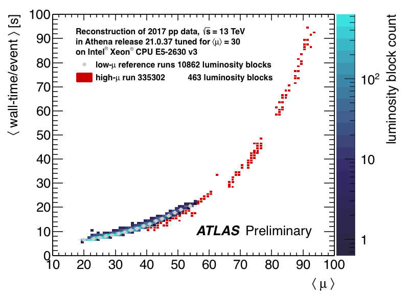
  <br>
  <em>Reconstruction wall-time per event vs. pileup ⟨μ⟩. Source: ATLAS Collaboration.</em>
</p>

Spiking neural networks offer a different computational model: instead of dense, continuous-valued matrix multiplications every layer, neurons communicate via sparse, discrete spikes and only do work when a spike arrives — much like biological neurons.

<p align="center">
  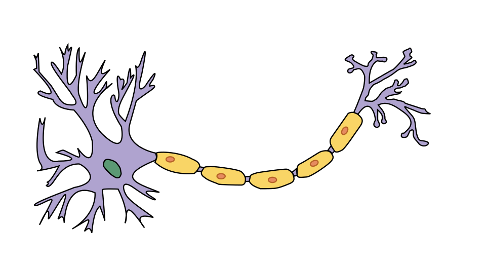
  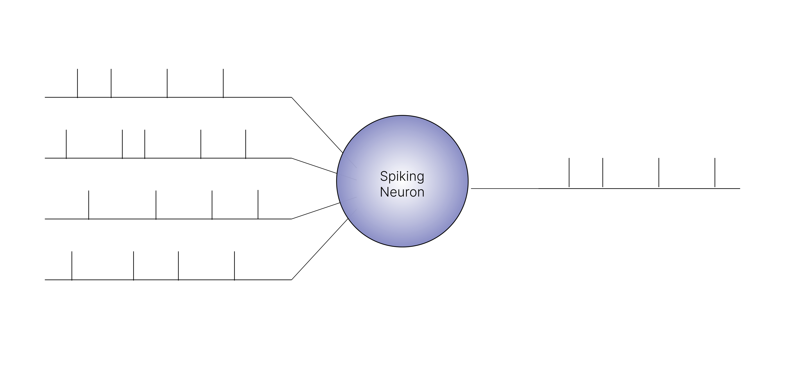
  <br>
  <em>From biological neuron (left) to the spiking-neuron abstraction used here (right): multiple input spike trains combine into a single output spike train.</em>
</p>

That event-driven sparsity is what makes SNNs a natural fit for neuromorphic hardware — and a promising way to keep hit-filtering fast and low-power as collision rates climb.

---

## Overview

Particle detectors at CERN produce on the order of 10⁵ hits per collision event. Identifying which hits belong to the same charged particle track — *track reconstruction* — is one of the most computationally demanding steps in the analysis pipeline.

This project implements a two-stage SNN pipeline that reduces the number of candidate hits before full reconstruction begins — filtering in both geometric space (cone-level) and angular space (φ-bin level). The networks are built on **Recurrent Adaptive LIF (RadLIF)** neurons, which extend the spiking neuron above with recurrent connections and spike-frequency adaptation.

<p align="center">
  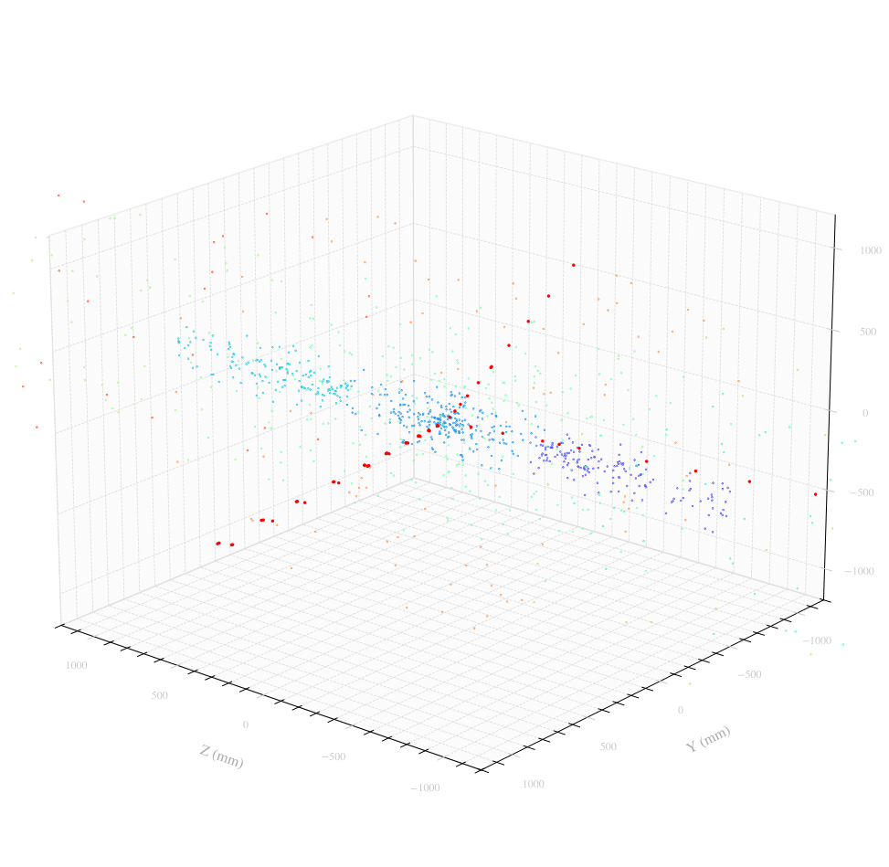
  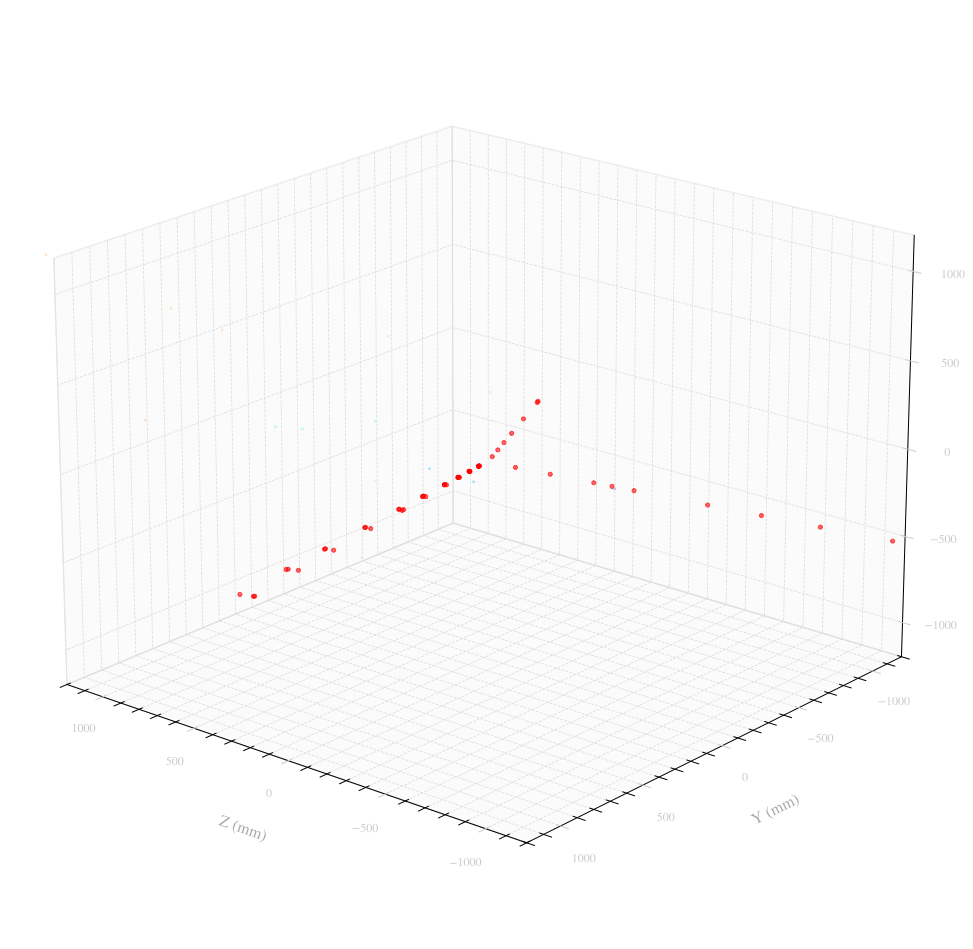
  <br>
  <em>One held-out event before filtering (left, true track in red among detector noise) and after the full two-stage SNN pipeline (right) — only the real track survives.</em>
</p>

---

## Pipeline

### Stage 1 — Cone Filter

The detector volume is split into 8 octant cones. For each cone, hits are projected onto a **100×100 r-z grid** and fed into a RadLIF SNN that classifies whether the cone contains a signal track. Cones classified as background are discarded entirely.

### Stage 2 — φ-Bin Localiser

Cones that pass Stage 1 are projected onto a **100×100 r-φ grid**, augmented with a column occupancy feature that encodes the coherent columnar structure of genuine tracks. A second RadLIF SNN identifies which φ-bins contain signal hits, further narrowing the candidate set for downstream reconstruction.

<p align="center">
  
  <br>
  <em>Progressive hit removal across the pipeline: raw hits (left) → after Stage 1 cone filter (centre) → after Stage 2 φ-bin localiser (right).</em>
</p>

**The full Stage 1 classification pipeline, end to end:**

<p align="center">
  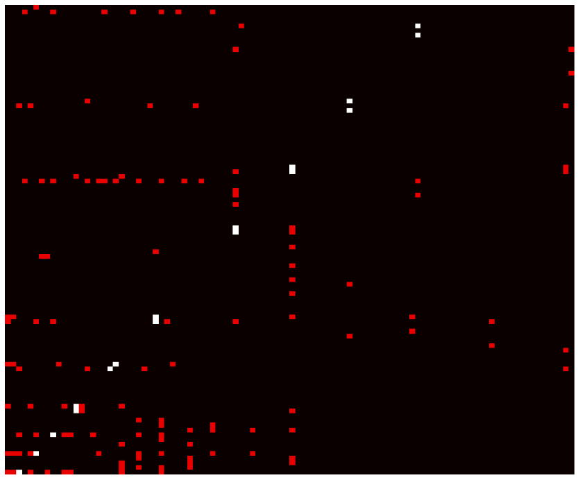
  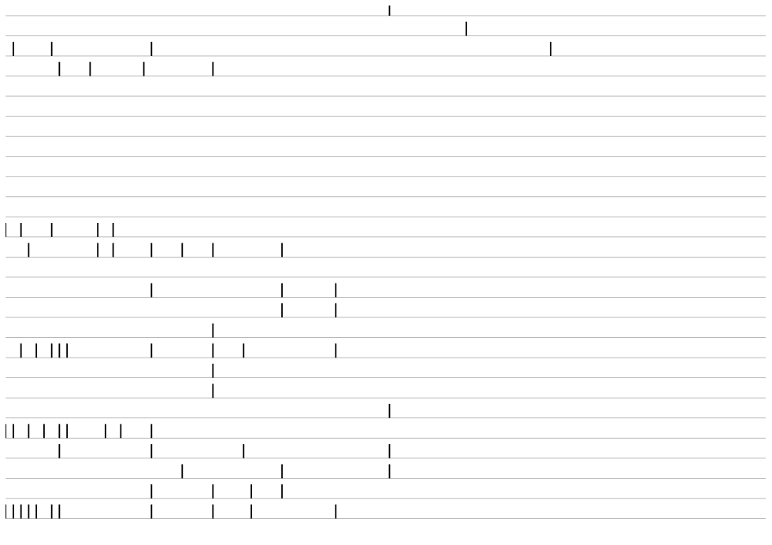
  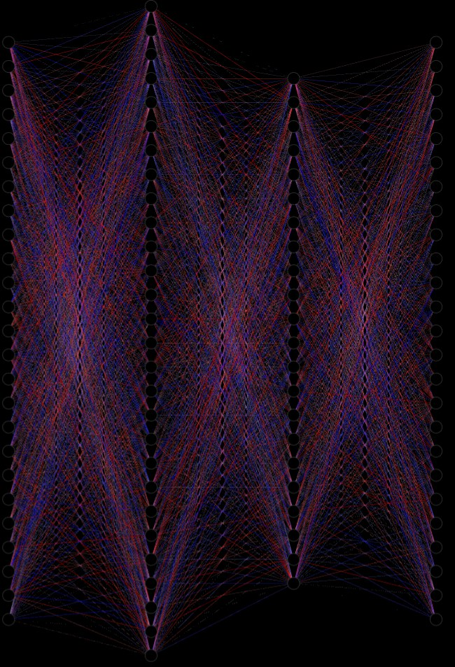
  <br>
  <em>(a) An r-z projection matrix for a single cone, white = signal. (b) Each matrix row is presented to the network as one timestep, converting the spatial hit pattern into a spike train. (c) The two-layer RadLIF classifier and its learned weight structure.</em>
</p>

---

## Model Architecture

Both stages use a fully connected two-layer **RadLIF** network from the [SPArch framework](https://github.com/idiap/sparch), trained with backpropagation through time (BPTT) and a boxcar surrogate gradient. The RadLIF neuron extends the standard leaky integrate-and-fire model with recurrent connections and spike-frequency adaptation.

```
Input grid (100×100)  →  RadLIF layer 1 (512)  →  RadLIF layer 2 (256)  →  Linear  →  Output
```

Six parameter groups are learned jointly: feedforward weights **W**, recurrent weights **V**, membrane decay rate α, adaptation decay rate β, subthreshold coupling *a*, and spike-triggered adaptation *b*.

<p align="center">
  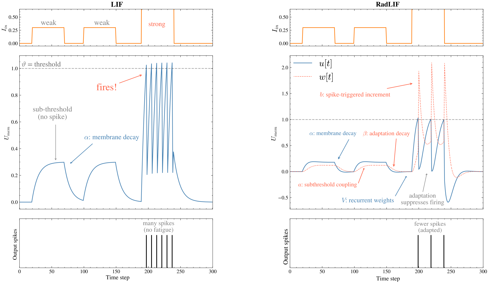
  <br>
  <em>Plain LIF (left) vs. RadLIF (right): recurrent coupling and spike-triggered adaptation let RadLIF suppress firing after repeated activation, instead of firing at a constant rate.</em>
</p>

<p align="center">
  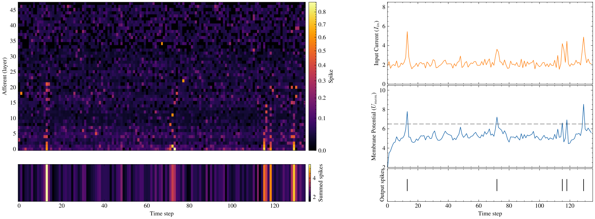
  <br>
  <em>A real cone's input spikes (top), the resulting membrane potential (middle), and the neuron's output spikes (bottom).</em>
</p>

---

## Dataset

The [TrackML Particle Tracking Challenge](https://www.kaggle.com/c/trackml-particle-identification) dataset simulates HL-LHC detector conditions, including high-pileup environments with up to 200 simultaneous proton–proton collisions per event.

- ~10⁵ hits per event from ~10⁴ charged particles
- Signal selection: pT ≥ 10 GeV/c and nhits > 10
- Background subsampled to 1% per event during training
- Training scales evaluated: 100, 1000, and 1800 events
- Strict event-level train/test split (no shared particles between sets)

---

## Results

Evaluated on 20 held-out test events with classification thresholds p_S1 = 0.5, p_S2 = 0.6.

| Metric | 100 events | 1000 events |
|---|---|---|
| S1 signal efficiency | 80.8% | 80.8% |
| S1 noise throwrate | 46.0% | 55.6% |
| S2 detection rate | 92.9% | 97.6% |
| S2 precision | 71.4% | 85.3% |
| Track survival | 80.8% | 84.5% |

**Optimised configuration** (512×256, lr=1e-3, dropout=0.1) via grid search over 12 Stage 1 configurations:
- Signal efficiency: **92.8%**
- Noise throwrate: **96.9%**
- Stage 2 IoU: **81.7%** (up from 70.0% baseline)

<p align="center">
  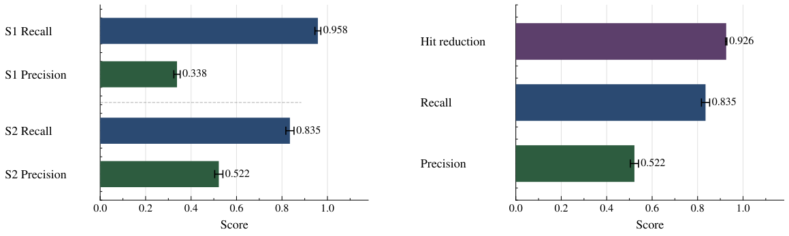
  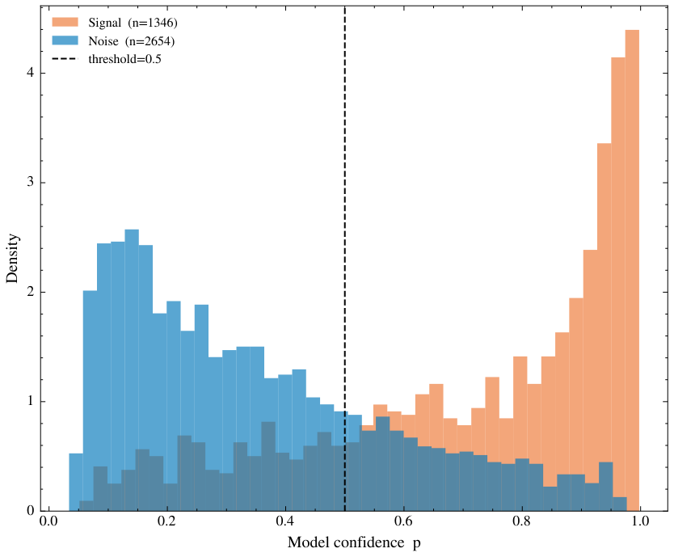
  <br>
  <em>Left: pipeline recall/precision by stage and overall hit reduction. Right: Stage 1 classifier confidence for true signal vs. noise cones — clean separation either side of the 0.5 threshold.</em>
</p>

---

## Repository Structure

```
build_datasets/    # Scripts that build training matrices from raw TrackML events
training/          # Stage 1 / Stage 2 model training scripts
grid_search/       # Hyperparameter grid search + optimisation summaries
evaluation/        # ROC curves, threshold sweeps, full-pipeline tests
plotting/          # Visualisation scripts
cluster_scripts/   # SLURM/UPPMAX submission scripts
exploratory/       # Early exploratory scripts (pre-pipeline EDA, baseline, param inspection)
Functions.py       # Shared preprocessing utilities
SNN/               # RadLIFLayer model definition (snns.py)
figures/           # Output plots and PDFs
img/               # README figures
```

Large files (raw TrackML events, `.npy` matrices, `.pt` model weights) are excluded via `.gitignore`.

---

## Requirements

```
torch
numpy
pandas
scikit-learn
matplotlib
trackml          # pip install git+https://github.com/LAL/trackml-library
```

The SPArch RadLIF implementation is included directly in `SNN/snns.py`, adapted from [Bittar & Garner (2022)](https://doi.org/10.3389/fnins.2022.865897).

---

## Usage

**1. Build training matrices**
```bash
python build_datasets/build_data100.py
```

**2. Train Stage 1 (cone filter)**
```bash
python training/train_s1_100.py
```

**3. Train Stage 2 (φ-bin localiser)**
```bash
python training/train_s2_100.py
```

For cluster (UPPMAX/SLURM) runs, see the submission scripts in `cluster_scripts/`.

---


## Author

Felix Martin · Engineering Physics, Uppsala University · [GitHub](https://github.com/FelixJMartin)
