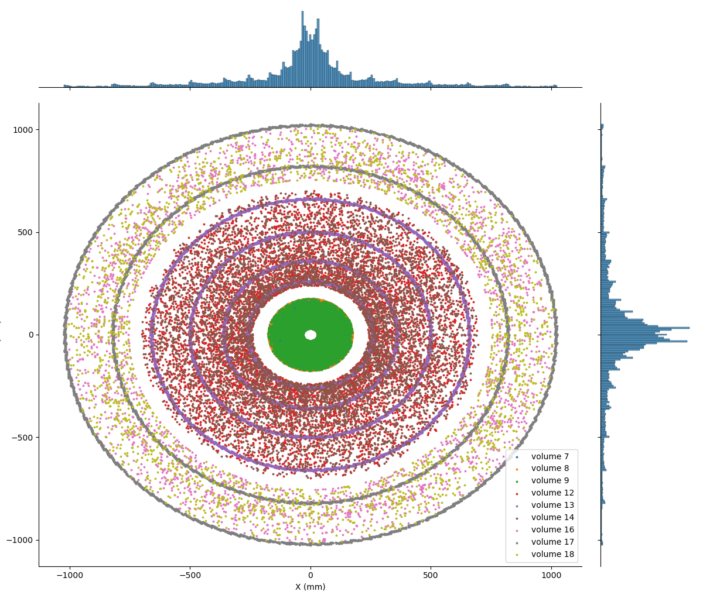
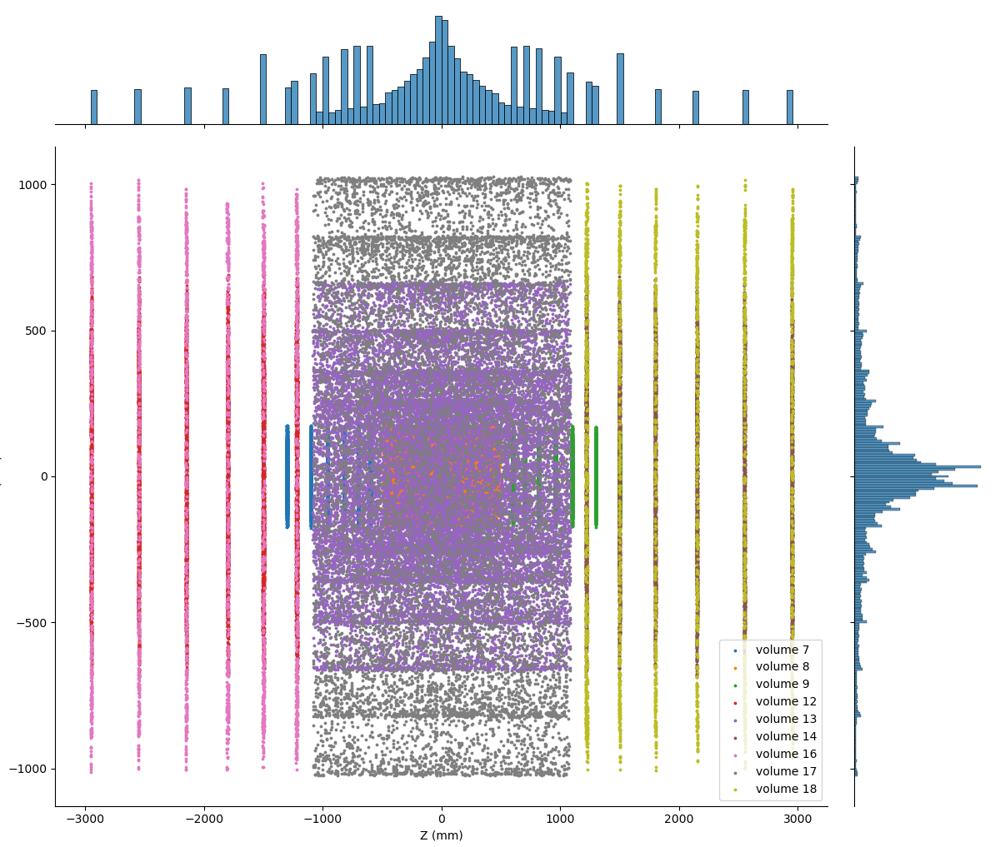
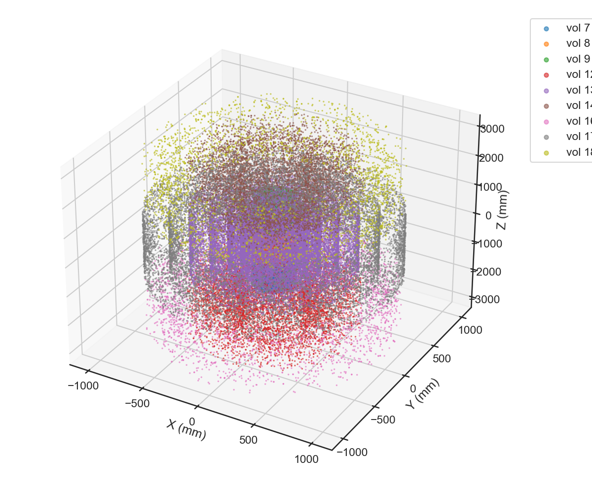
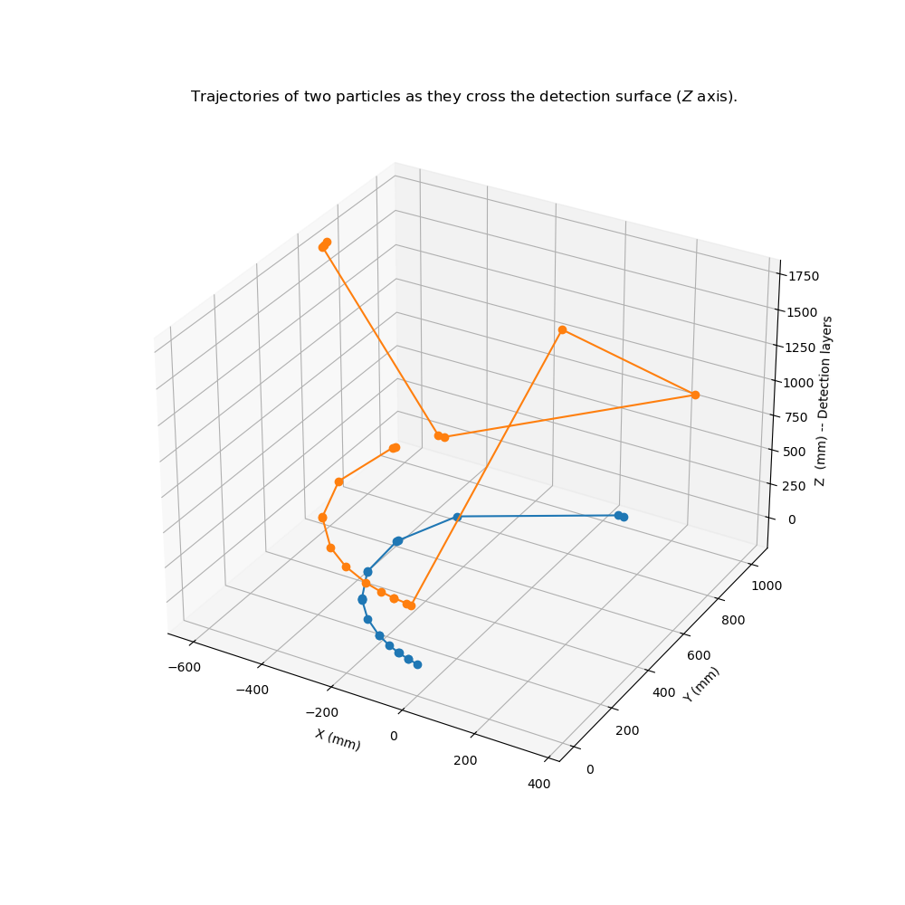
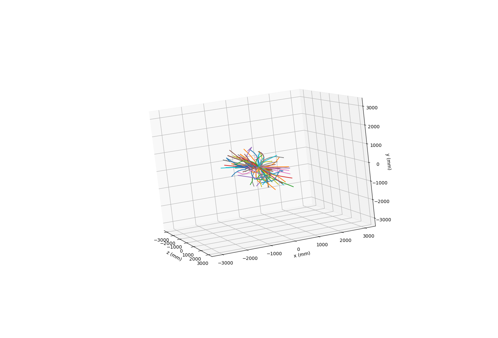
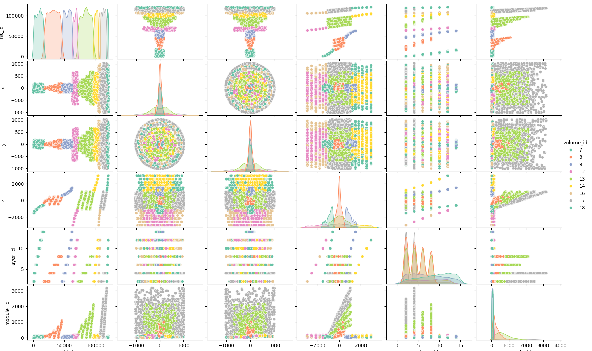
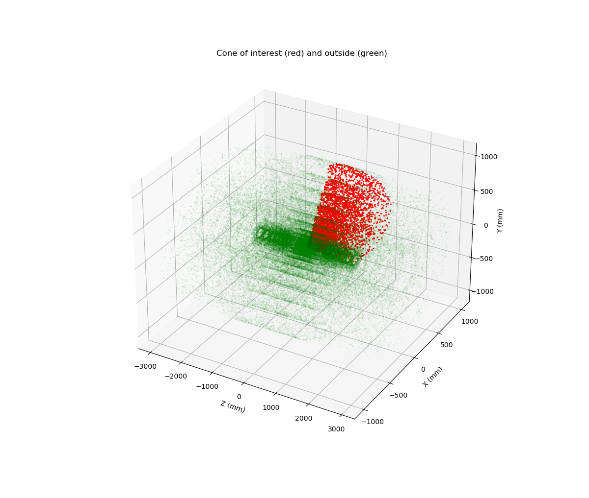
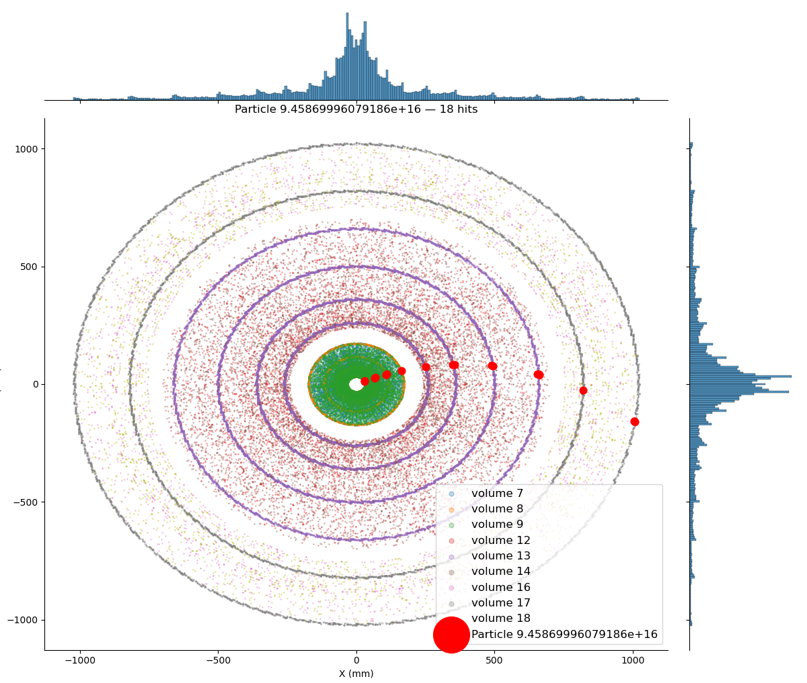

## ML Track Challenge

## Challenge Overview and Goal

The dataset consists of many independent events, where each event represents a single proton–proton collision at the Large Hadron Collider (LHC) at CERN. During a collision, thousands of charged particles are produced and pass through a large detector. As these particles travel through the detector, they leave behind discrete measurements, called *hits*, which can be thought of as three-dimensional points in space.

The goal of the tracking machine learning challenge is to reconstruct the trajectories of the original particles by grouping these recorded hits into *tracks*. Each track corresponds to a single particle, and each hit must be uniquely assigned to exactly one track.

The training dataset provides the recorded detector hits together with ground-truth information, including which particle generated each hit and the initial properties of those particles. The test dataset contains only the recorded hits, and the task is to infer the correct hit-to-track associations without access to the ground truth.

This repository contains ongoing work from my bachelor’s thesis on machine learning methods for particle track reconstruction at the LHC at CERN.

---

## Week 1

The project begins with visualizing small LHC datasets to gain intuition for the problem and to better understand the structure and scale of the data.

  
  
  

I then explored ground-truth particle trajectories to study the effects of the magnetic field and the resulting helical track shapes. 
Using the pandas library, I visualized angular distributions and kinematic parameters to build a more complete understanding of the available data.

  
  
  

## week 2

This week began with a deeper analysis of the dataset and the implementation of several simplifications. During meetings with physicists from the data team, we were informed that the most relevant physics is associated with high-energy particles, which are less affected by the magnetic field and therefore follow approximately straight trajectories outward from the interaction point in a cone-like shape.

Based on this insight, we modified the code to extract hits within a cone extending from the origin outward toward the detector.

  

# Week 3

Added a new selection.py file for more efficiently extracting relevant data and removing a large portion of it as instructed by the physicist, in order to scale down the files. I did this by computing vectors toward all points and taking the dot product with the x-axis, and can now change a single parameter to get a different cone size.

# Week 4

Started implementing a spiking neural network (SNN) based on the Coradin et al. paper. The first step was encoding detector hits into spikes using cylindrical coordinates: each hit's azimuthal angle phi is mapped to a spike arrival time, and its detector layer maps to an afferent index. Implemented the LIF neuron model with EPSP and reset kernels from the paper, and simulated the membrane potential to reproduce Figure 4. Added edge extension of 0.7 rad to handle particles crossing the phi=0 boundary.

  
  
  

